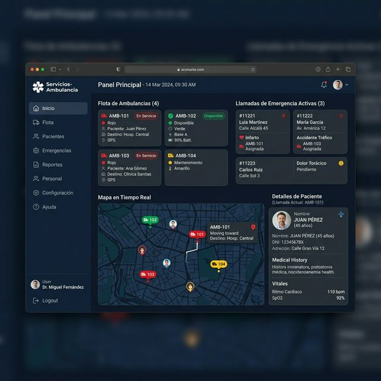

# Servicios-Ambulancia - CRM Clinico

> Sistema de gestao de frota de ambulancias e emergencias.

## Para quem nao e tecnico

- Gerencia frota de ambulancias em tempo real no mapa
- Controla pacientes e historico medico
- Registra chamadas de emergencia
- Gerencia tripulantes e escalas

## Preview do Sistema

## Funcionalidades

- Rastreamento GPS em tempo real
- Gestao de chamadas de emergencia ativas
- Ficha clinica do paciente
- Relatorios de atendimento

## Stack Tecnica

| Tecnologia | Uso |
|-----------|-----|
| Next.js 15 | Frontend web |
| Supabase | Banco de dados + Realtime |
| Google Maps API | Rastreamento GPS |
| TypeScript | Tipagem |

## Contato

Desenvolvido por **Dioran Rodriguez** - diorato@live.com
